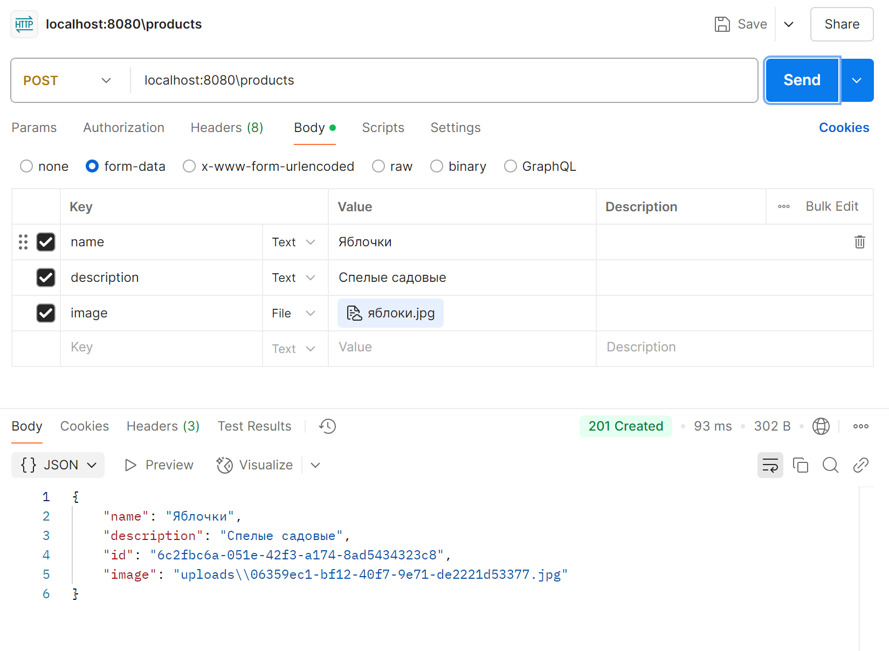
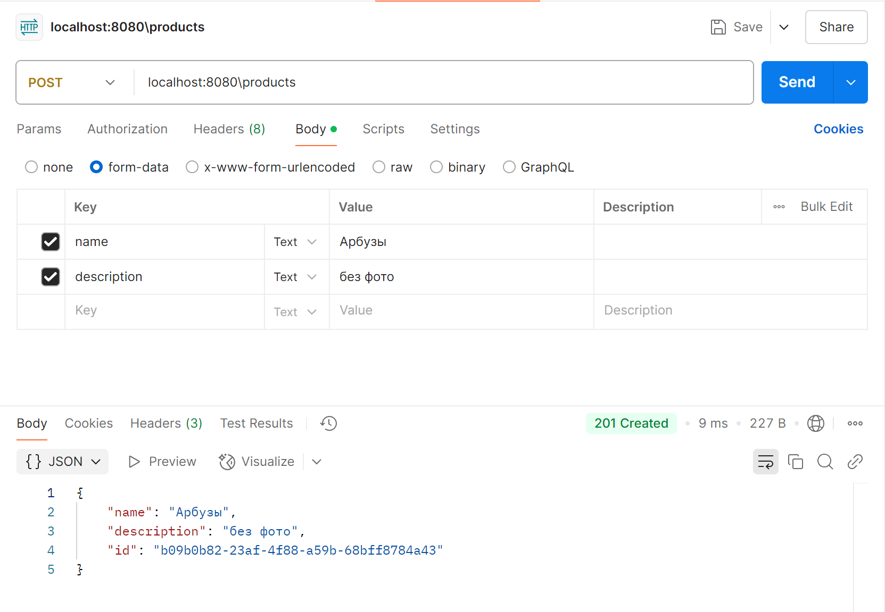
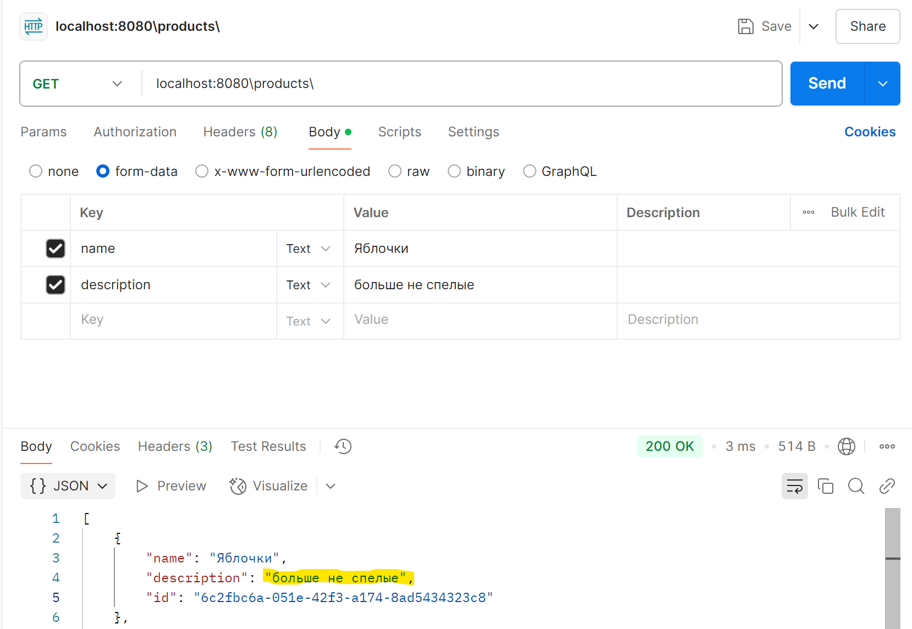
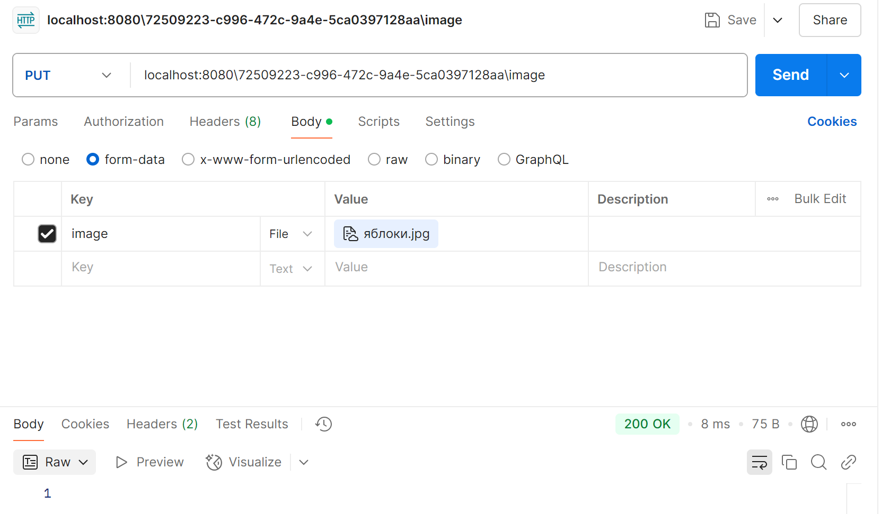
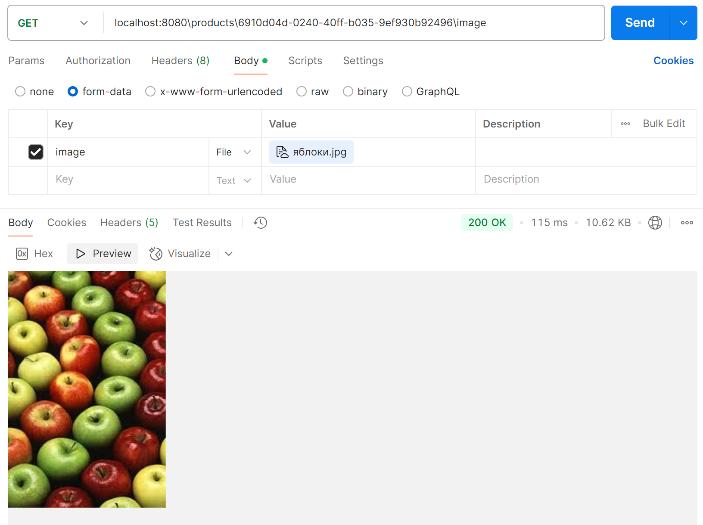

# Практика 2. Rest Service

## Программирование. Rest Service. Часть I

### Задание А (3 балла)
Создайте простой REST сервис, в котором используются HTTP операции GET, POST, PUT и DELETE.
Предположим, что это сервис для будущего интернет-магазина, который пока что умеет 
работать только со списком продуктов. У каждого продукта есть поля: `id` (уникальный идентификатор),
`name` и `description`. 

Таким образом, json-схема продукта (обозначим её `<product-json>`):

```json
{
  "id": 0,
  "name": "string",
  "description": "string"
}
```

Данные продукта от клиента к серверу должны слаться в теле запроса в виде json-а, **не** в параметрах запроса.

Ваш сервис должен поддерживать следующие операции:
1. Добавить новый продукт. При этом его `id` должен сгенерироваться автоматически
   - `POST /product`
   - Схема запроса:
     ```json
     {
       "name": "string",
       "description": "string"
     }
     ```
   - Схема ответа: `<product-json>` (созданный продукт)
2. Получить продукт по его id
   - `GET /product/{product_id}`
   - Схема ответа: `<product-json>`
3. Обновить существующий продукт (обновляются только те поля продукта, которые были переданы в теле запроса)
   - `PUT /product/{product_id}`
   - Схема запроса: `<product-json>` (некоторые поля могут быть опущены)
   - Схема ответа: `<product-json>` (обновлённый продукт)
4. Удалить продукт по его id
   - `DELETE /product/{product_id}`
   - Схема ответа: `<product-json>` (удалённый продукт)
5. Получить список всех продуктов 
   - `GET /products`  
   - Схема ответа:
     ```
     [ 
       <product-json-1>,
       <product-json-2>, 
       ... 
     ]
     ```

Предусмотрите возвращение ошибок (например, если запрашиваемого продукта не существует).

Вы можете положить код сервиса в отдельную директорию рядом с этим документом.

### Задание Б (3 балла)
Продемонстрируйте работоспособность сервиса с помощью программы Postman
(https://www.postman.com/downloads) и приложите соответствующие скрины, на которых указаны
запросы и ответы со стороны сервиса для **всех** его операций.

#### Демонстрация работы
todo

### Задание В (4 балла)
Пусть ваш продукт также имеет иконку (небольшую картинку). Формат иконки (картинки) может
быть любым на ваш выбор. Для простоты будем считать, что у каждого продукта картинка одна.

Добавьте две новые операции:
1. Загрузить иконку:
   - `POST product/{product_id}/image`
   - Запрос содержит бинарный файл — изображение  
     
2. Получить иконку:
   - `GET product/{product_id}/image`
   - В ответе передаётся только сама иконка  
     

Измените операции в Задании А так, чтобы теперь схема продукта содержала сведения о загруженной иконке, например, имя файла или путь:
```json
{
  "icon": "string"
}
```

#### Демонстрация работ
1. Добавление продукта с картинкой (картинка опционально)
   
2. Получение продуктов
   
3. Добавление без картики
   
4. Получение продуктов
   
5. Получение по `ID`
   
6. Получение после обновления данных
   
7. Получение после удаления
   
8. Обновление картинки по `ID`
   
9. Получение картинки по `ID`
   
    
## Задачи

### Задача 1 (2 балла)
Общая (сквозная) задержка прохождения для одного пакета от источника к приемнику по пути,
состоящему из $N$ соединений, имеющих каждый скорость $R$ (то есть между источником и
приемником $N - 1$ маршрутизатор), равна $d_{\text{сквозная}} = N \dfrac{L}{R}$
Обобщите данную формулу для случая пересылки количества пакетов, равного $P$.

#### Решение
Общее время составит время от начала отправки первого пакеты до первого коммутатора и общее время в пути последнего пакета, что составит
$(P-1) \dfrac{L}{R} + N \dfrac{L}{R} = ( N + P - 1) \dfrac{L}{R}$

### Задача 2 (2 балла)
Допустим, мы хотим коммутацией пакетов отправить файл с хоста A на хост Б. Между хостами установлены три
последовательных канала соединения со следующими скоростями передачи данных:
$R_1 = 200\dfrac{Кбит}{с}$, $R_2 = 3 \dfrac{Мбит}{с}$ и $R_3 = 2 \dfrac{Мбит}{с}.
Сколько времени приблизительно займет передача на хост Б файла размером $5$ мегабайт?
Как это время зависит от размера пакета?

#### Решение
Обычно скорость считается по меньше скорости (узкому месту системы), в таком случае Мы получим, что
общее время $t = \dfrac{5 * 1024 * 8 Кбит}{200 \dfrac{Кбит}{сек}} = 204,8$, но можно учесть, что данные будут проходить еще по двум
каналам на них мы потратим $\dfrac{5 * 8}\{3} + \dfrac{5 * 8}\{2} = 33,3$.


### Задача 3 (2 балла)
Предположим, что пользователи делят канал с пропускной способностью $2$ Мбит/с. Каждому
пользователю для передачи данных необходима скорость $100$ Кбит/с, но передает он данные
только в течение $20$ процентов времени использования канала. Предположим, что в сети всего $60$
пользователей. А также предполагается, что используется сеть с коммутацией пакетов. Найдите
вероятность одновременной передачи данных $12$ или более пользователями.

#### Решение
Скажем что в силу пропускной способности у нас не может быть больше 34 пользователей т.к. $35 * 100\dfrac{Кбит}{c} > 2\dfrac{Мбит}{c}$.
Теперь нам надо посчитать вероятность $P(12 \leq X \leq 34)$, где X - биномиальное распределение 60 пользователй с коэффицинетом 0.2, 
что примерно равно $0.4236$

### Задача 4 (2 балла)
Пусть файл размером $X$ бит отправляется с хоста А на хост Б, между которыми три линии связи и
два коммутатора. Хост А разбивает файл на сегменты по $S$ бит каждый и добавляет к ним
заголовки размером $80$ бит, формируя тем самым пакеты длиной $L = 80 + S$ бит. Скорость
передачи данных по каждой линии составляет $R$ бит/с. Загрузка линий мала, и очередей пакетов
нет. При каком значении $S$ задержка передачи файла между хостами А и Б будет минимальной?
Задержкой распространения сигнала пренебречь.

#### Решение
Рассчитаем общее время передачи всех пакетов как отправление прдпоследнего пакета до первого 
коммутатора и общее время передачи одного пакета от хоста до хоста: $\dfrac{80 + S}{R}\cdot(\dfrac{X}{S}-1) + 2 * \dfrac{80 + S}{R}$.
Возьмем у этого дела производную и получим $-\dfrac{80 * X}{S^2 * R} + \dfrac{2}{R}= 0$. Отсюда $S =\sqrt{\dfrac{40X$

### Задание 5 (2 балла)
Рассмотрим задержку ожидания в буфере маршрутизатора. Обозначим через $I$ интенсивность
трафика, то есть $I = \dfrac{L a}{R}$.
Предположим, что для $I < 1$ задержка ожидания вычисляется как $\dfrac{I \cdot L}{R (1 – I)}$. 
1. Напишите формулу для общей задержки, то есть суммы задержек ожидания и передачи.
2. Опишите зависимость величины общей задержки от значения $\dfrac{L}{R}$.

#### Решение
todo
