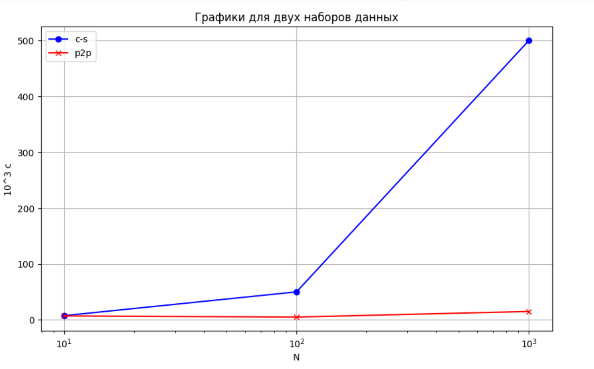

# Практика 5. Прикладной уровень

## Программирование сокетов.

### A. Почта и SMTP (7 баллов)

### 1. Почтовый клиент (2 балла)
Напишите программу для отправки электронной почты получателю, адрес
которого задается параметром. Адрес отправителя может быть постоянным. Программа
должна поддерживать два формата сообщений: **txt** и **html**. Используйте готовые
библиотеки для работы с почтой, т.е. в этом задании **не** предполагается общение с smtp
сервером через сокеты напрямую.

Приложите скриншоты полученных сообщений (для обоих форматов).

#### Демонстрация работы
todo

### 2. SMTP-клиент (3 балла)
Разработайте простой почтовый клиент, который отправляет текстовые сообщения
электронной почты произвольному получателю. Программа должна соединиться с
почтовым сервером, используя протокол SMTP, и передать ему сообщение.
Не используйте встроенные методы для отправки почты, которые есть в большинстве
современных платформ. Вместо этого реализуйте свое решение на сокетах с передачей
сообщений почтовому серверу.

Сделайте скриншоты полученных сообщений.

#### Демонстрация работы
todo

### 3. SMTP-клиент: бинарные данные (2 балла)
Модифицируйте ваш SMTP-клиент из предыдущего задания так, чтобы теперь он мог
отправлять письма с изображениями (бинарными данными).

Сделайте скриншот, подтверждающий получение почтового сообщения с картинкой.

#### Демонстрация работы
todo

---

_Многие почтовые серверы используют ssl, что может вызвать трудности при работе с ними из
ваших приложений. Можете использовать для тестов smtp сервер СПбГУ: mail.spbu.ru, 25_

### Б. Удаленный запуск команд (3 балла)
Напишите программу для запуска команд (или приложений) на удаленном хосте с помощью TCP сокетов.

Например, вы можете с клиента дать команду серверу запустить приложение Калькулятор или
Paint (на стороне сервера). Или запустить консольное приложение/утилиту с указанными
параметрами. Однако запущенное приложение **должно** выводить какую-либо информацию на
консоль или передавать свой статус после запуска, который должен быть отправлен обратно
клиенту. Продемонстрируйте работу вашей программы, приложив скриншот.

Например, удаленно запускается команда `ping yandex.ru`. Результат этой команды (запущенной на
сервере) отправляется обратно клиенту.

#### Демонстрация работы
todo

### В. Широковещательная рассылка через UDP (2 балла)
Реализуйте сервер (веб-службу) и клиента с использованием интерфейса Socket API, которая:
- работает по протоколу UDP
- каждую секунду рассылает широковещательно всем клиентам свое текущее время
- клиент службы выводит на консоль сообщаемое ему время

#### Демонстрация работы
todo

## Задачи

### Задача 1 (2 балла)
Рассмотрим короткую, $10$-метровую линию связи, по которой отправитель может передавать
данные со скоростью $150$ бит/с в обоих направлениях. Предположим, что пакеты, содержащие
данные, имеют размер $100000$ бит, а пакеты, содержащие только управляющую информацию
(например, флаг подтверждения или информацию рукопожатия) – $200$ бит. Предположим, что у
нас $10$ параллельных соединений, и каждому предоставлено $1/10$ полосы пропускания канала
связи. Также допустим, что используется протокол HTTP, и предположим, что каждый
загруженный объект имеет размер $100$ Кбит, и что исходный объект содержит $10$ ссылок на другие
объекты того же отправителя. Будем считать, что скорость распространения сигнала равна
скорости света ($300 \cdot 10^6$ м/с).
1. Вычислите общее время, необходимое для получения всех объектов при параллельных
непостоянных HTTP-соединениях
2. Вычислите общее время для постоянных HTTP-соединений. Ожидается ли существенное
преимущество по сравнению со случаем непостоянного соединения?

#### Решение
Давайте сразу поймем, что время распрострарнения слишком мала, что ее учитывать
$\dfrac{2}{300\cdot 10^6}$.

Причем скорость передачи в однном соединении будет $150/10= 15 бит/c$

1. Для установки TCP оединения нам потребуется 3 рукопожатия, то есть 3 пакета по 200 бит,
дальше HTTP запрос на 200 бит и передача объекта и ответ 200 бит и повторение этого для 10 ссылок, то есть
будет $(3 + 2 * 11)$ запросов управляющей информации и $11$ передач объектов.
Рассчитаем $\dfrac{(3 + 2 * 11) * 200}{15} + \dfrac{11 * 100 * 10^3}{15} = 333 + 73330 = 73663$ c

2. В данно случае для получения ссылок у нас будет каждый раз настриваться новое TCP соединение и мы получим
$3 + 2$ для начального объекта и $10*(3 + 2)$ для последующих ссылок запросов управляющей информации и $11$ передач объектов.
Рассчитаем $\dfrac{5 * 11 * 200}{15} + \dfrac{11 * 100 * 10^3}{15} = 733 + 73330 = 74063$ c

аким образом разница в случаях постоянного и непостоянного соединения составляет всего 400 секунд, что в рамках общего времени передачи является незначительной.

### Задача 2 (3 балла)
Рассмотрим раздачу файла размером $F = 15$ Гбит $N$ пирам. Сервер имеет скорость отдачи $u_s = 30$
Мбит/с, а каждый узел имеет скорость загрузки $d_i = 2$ Мбит/с и скорость отдачи $u$. Для $N = 10$, $100$
и $1000$ и для $u = 300$ Кбит/с, $700$ Кбит/с и $2$ Мбит/с подготовьте график минимального времени
раздачи для всех сочетаний $N$ и $u$ для вариантов клиент-серверной и одноранговой раздачи.

#### Решение
1. $N = 10$ Время для клиент-сервера будет по формулу равняться
$\max\left(\dfrac{10 \cdot 15 \cdot 10^9}{30 \cdot 10^6}, \drfac{15 \cdot 10^9}{2 \cdot 10^6}\right)$ = $\max\left( 5 \cdot 10^3, 7,5 \cdot 10^3 \right) = 7,5 \cdot 10^3 $ .
Для одноранговой $\max\left(\dfrac{15\cdot 10^9}{30\cdot10^6}, \dfrac{15\cdot10^9}{2\cdot10^6}, \dfrac{10 \cdot 15 \cdot 10^9}{30 \cdot 10^6 + 10 \cdot 300 \cdot 10^3}\right)$ =
$\max(0,5 \cdot 10^3, 7,5 \cdot 10^3, 4,5 \cdot 10^3) = 7,5 \cdot 10^3 $ .

2. $N = 100$ Время для клиент-сервера будет по формулу равняться
$ \max\left(\dfrac{100 \cdot 15 \cdot 10^9}{30 \cdot 10^6}, \drfac{15\cdot10^9}{2\cdot10^6}\right)$ = $\max(50 \cdot 10^3, 7,5 \cdot 10^3) = 50 \cdot 10^3 $ .
Для одноранговой $\max\left(\dfrac{15\cdot10^9}{30\cdot10^6}, \dfrac{15\cdot10^9}{2\cdot10^6}, \dfrac{100 \cdot 15 \cdot 10^9}{30 \cdot 10^6 + 100 \cdot 700 \cdot 10^3}\right)$ =
$\max(0,5 \cdot 10^3, 7,5 \cdot 10^3, 15 \cdot 10^3) = 15 \cdot 10^3 $ .

3. $N = 1000$ Время для клиент-сервера будет по формулу равняться
$\max\left(\dfrac{1000 \cdot 15 \cdot 10^9}{30 \cdot 10^6}, \drfac{15 \cdot 10^9}{2 \cdot 10^6} \right)$ = $\max(500 \cdot 10^3, 7,5 \cdot 10^3) = 500 \cdot 10^3 $ .
Для одноранговой $\max(\dfrac{15\cdot10^9}{30\cdot10^6}, \dfrac{15\cdot10^9}{2\cdot10^6}, \dfrac{1000 \cdot 15 \cdot 10^9}{30 \cdot 10^6 + 10 \cdot 2 \cdot 10^6})$ =
$\max(0.5 \cdot 10^3, 7,5 \cdot 10^3, 7,5 \cdot 10^3) = 7,5 \cdot 10 ^3 $ .

### Задача 3 (3 балла)
Рассмотрим клиент-серверную раздачу файла размером $F$ бит $N$ пирам, при которой сервер
способен отдавать одновременно данные множеству пиров – каждому с различной скоростью,
но общая скорость отдачи при этом не превышает значения $u_s$. Схема раздачи непрерывная.
1. Предположим, что $\dfrac{u_s}{N} \le d_{min}$.
   При какой схеме общее время раздачи будет составлять $\dfrac{N F}{u_s}$?
2. Предположим, что $\dfrac{u_s}{N} \ge d_{min}$. 
   При какой схеме общее время раздачи будет составлять  $\dfrac{F}{d_{min}}$?
3. Докажите, что минимальное время раздачи описывается формулой $\max\left(\dfrac{N F}{u_s}, \dfrac{F}{d_{min}}\right)$?

#### Решени
1. В данном случае сервер может установить соединение с каждым пиром и выгружать ему данные
со скоростю $\dfrac{u_s}{N}$, что не превышает скорость получения им данных, тогда передача данных каждому пиру займет время
$\dfrac{F}{\dfrac{u_s}{N}}$ = $\dfrac{N * F}{u_s}$

2. Давайте будем передавать пиру данные со скоростью $min{\dfrac{u_s}{N}, d_i}$, тогда общая скорость
передачи не будет превышать $u_s$. Теперь посчитаем общее время передачи для каждого пира:
$\frac{F}{min\left(\dfrac{u_s}{N}, d_i\right)}$, максимальное значение времени будет достигаться при $d_i = d_{min}$
и получим время равное $\dfrac{F}{d_{min}}$.

3. Замеитм, что каждый пир должен загрузить файл к себе, то есть он потратит на это время
$\frac{F}{d_i} \leq \dfrac{F}{d_{min}}$, то есть мы не можем потратить время меньшее чем $\dfrac{F}{d_{min}}$.
С другой стороны сервер должен отправить $N * F$ бит и его скорость не превышает $u_s$, то есть он потратит не менее
$\dfrac{N*F}\{u_s}$ времени.

Так мы получили, что время передачи $\geq max\left(\dfrac{N* F}{u_s}, \dfrac{F}{d_{min}}\right)$, теперь обратимся к пунктам 1 и 2
этой задачи и в зависимости от знака в сравнении $\dfrac{u_s}{N}$ и $d_{min}$ добьемся нужного времени.

